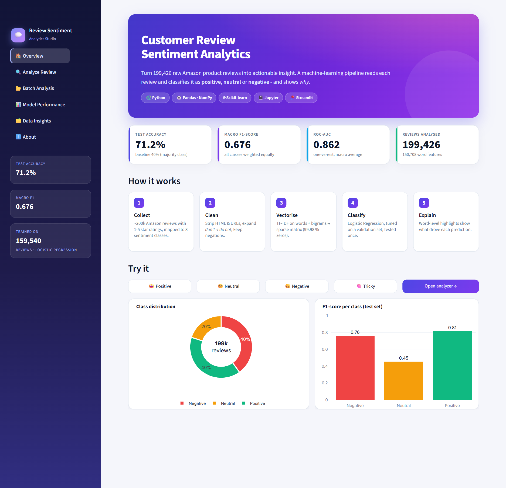
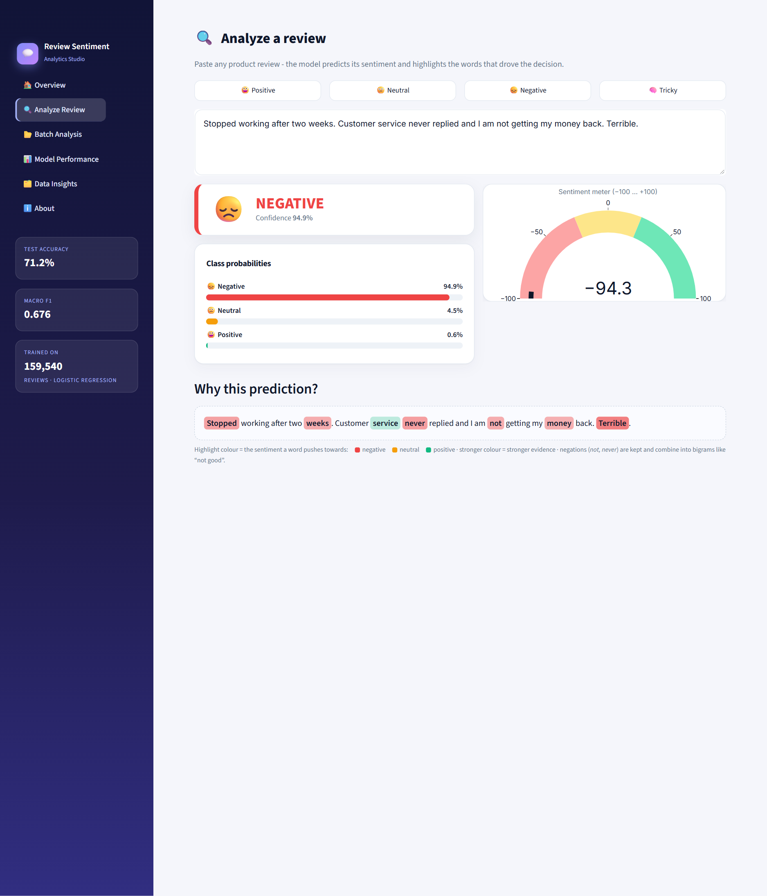
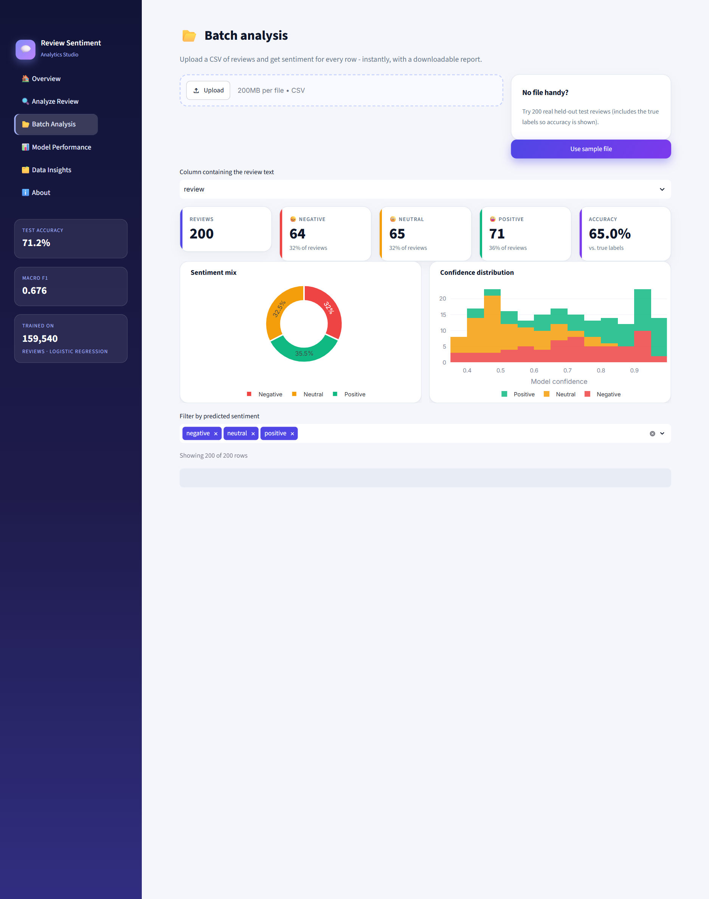
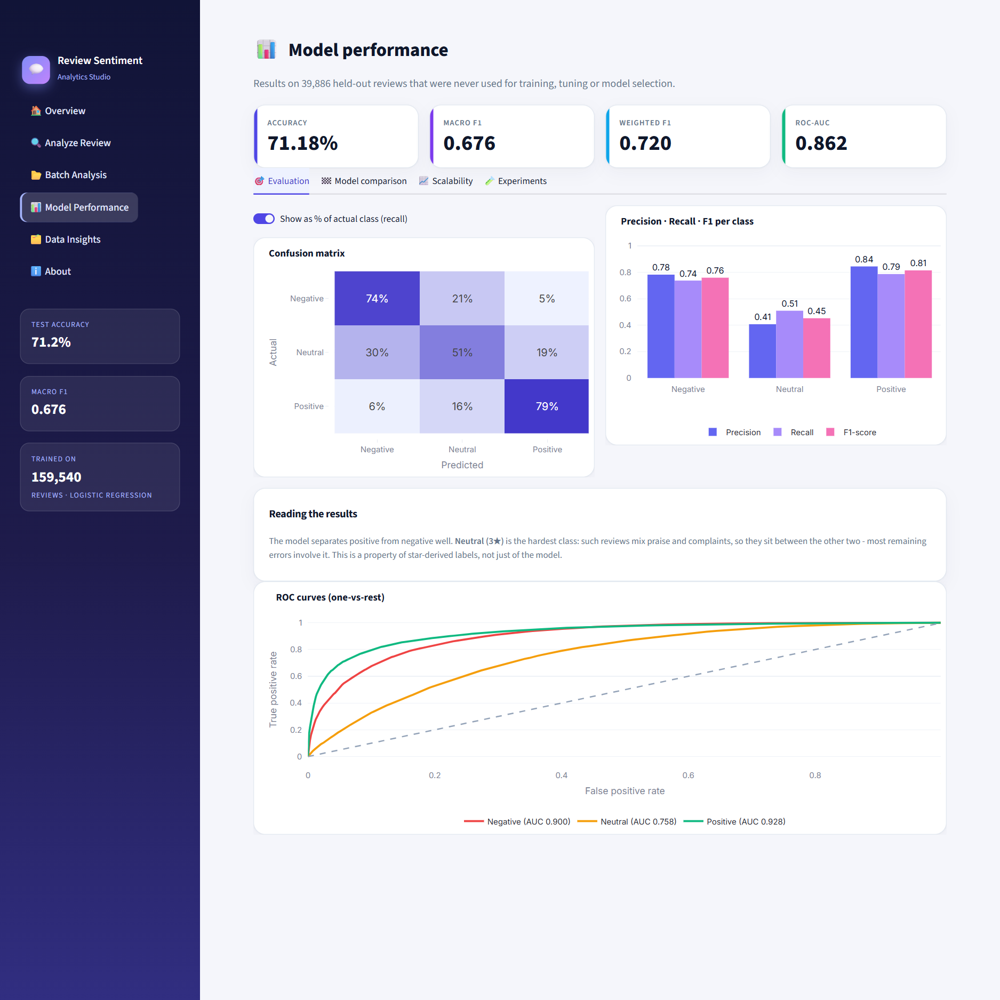
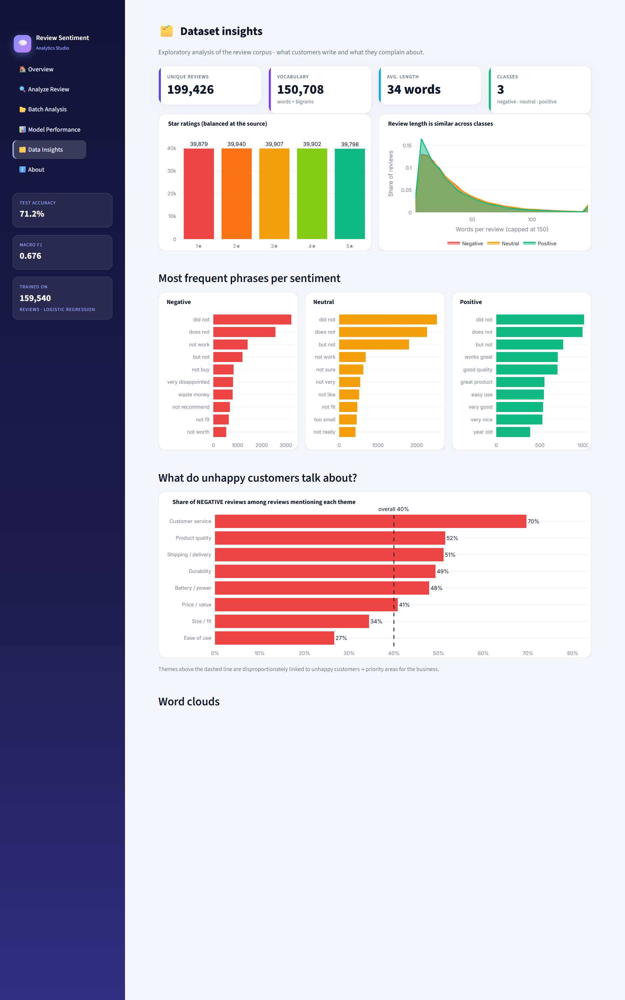

# 💬 Customer Review Sentiment Analytics
**Big Data Analytics using Python and Machine Learning**

Classifies **~200,000 Amazon product reviews** as **positive, neutral or negative**, explains every prediction word-by-word, and turns the results into business insight - delivered as an executed Jupyter notebook and an interactive Streamlit dashboard.

**Tools:** Python · Pandas · NumPy · Scikit-learn · Jupyter Notebook · Streamlit (+ Plotly)

<p align="center">
  
</p>

## ✨ Highlights
- **Real big data:** 199,426 unique reviews, a 150k-feature **sparse** TF-IDF matrix (99.9 %+ zeros), scalability study and **out-of-core streaming** training.
- **Rigorous evaluation:** stratified 70/10/20 split, models compared and tuned on validation only, test set used **once**.
- **Six models compared:** majority baseline, Multinomial NB, Complement NB, SGD, Linear SVM, Logistic Regression.
- **Smart NLP:** custom cleaning that **keeps negations** (*not good ≠ good*); an ablation study proves it helps.
- **Explainable:** highlights which words pushed each prediction toward positive / neutral / negative.
- **Business insight:** complaint-theme analysis (customer service, quality, shipping …).
- **Production habits:** reusable modules, 30 automated tests, reproducible one-command training.

## 📊 Results (held-out test set - 39,886 reviews never used for training or tuning)

| Metric | Value |
|---|---|
| Accuracy | **71.2 %** (majority-class baseline: 40.0 %) |
| Macro F1 | **0.676** |
| ROC-AUC (macro, one-vs-rest) | **0.862** |
| F1 - positive / negative / neutral | 0.815 / 0.760 / 0.453 |

Neutral (3★) is inherently ambiguous - such reviews mix praise and complaints - so ~86 % of all errors involve it. Experiments (5-class training, model averaging, character n-grams, threshold tuning) gained under 1 point, suggesting bag-of-words models plateau near this level on star-derived labels.

## 🖥️ Dashboard
| Analyze a review | Batch analysis |
|---|---|
|  |  |

| Model performance | Data insights |
|---|---|
|  |  |

## 🚀 Quick start
```bash
git clone https://github.com/bharath050305/customer-review-sentiment-analytics.git
cd customer-review-sentiment-analytics
pip install -r requirements.txt

streamlit run app.py                      # the trained model is included - works immediately
```
Optional - reproduce everything:
```bash
python -m src.download_data               # fetch the 47 MB dataset
python -m src.train                       # compare, tune, evaluate, save (~3 min)
python -m src.facts                       # latency / memory / error breakdown
python -m pytest tests -q                 # 30 automated tests
jupyter lab notebooks/Customer_Review_Sentiment_Analysis.ipynb
```
Try the **Batch Analysis** page with `data/demo_reviews.csv` (42 hand-written reviews) or `data/sample_reviews.csv` (200 real reviews with true labels).

## 🗂️ Project structure
```
├── app.py                         # Streamlit dashboard (6 pages)
├── assets/style.css               # dashboard styling
├── src/
│   ├── preprocess.py              # loading, labelling, text cleaning
│   ├── modeling.py                # TF-IDF factory + scoring helpers
│   ├── train.py                   # compare / tune / evaluate / save
│   ├── facts.py                   # latency, throughput, memory, errors
│   └── download_data.py           # dataset downloader
├── notebooks/Customer_Review_Sentiment_Analysis.ipynb   # executed, with outputs
├── tests/                         # unit, model and dashboard tests
├── models/sentiment_model.joblib  # trained TF-IDF + Logistic Regression pipeline
├── outputs/                       # metrics.json, csv exports, figures/
├── data/                          # demo + sample CSVs (raw data downloaded on demand)
└── docs/                          # project report, presentation script, diagrams, screenshots
```

## 🧪 Methodology
1. **Data** - 1-2★ → negative (40 %), 3★ → neutral (20 %), 4-5★ → positive (40 %).
2. **EDA** - class balance, review length, frequent words/phrases, word clouds, complaint themes.
3. **Cleaning** - HTML/URL removal, lower-casing, contraction expansion (*don't → do not*), custom stop-words that preserve negations and intensifiers.
4. **Features** - TF-IDF on unigrams + bigrams, sub-linear term frequency, stored as a SciPy sparse matrix.
5. **Models & tuning** - six models compared on validation; 3-fold grid search over n-grams, `min_df`, `C`; balanced class weights for the imbalance.
6. **Evaluation** - accuracy, per-class precision/recall/F1, macro-F1, ROC-AUC, confusion matrix, error analysis.
7. **Big-data techniques** - sparse matrices; learning-curve and timing study; out-of-core training with `HashingVectorizer` + `SGDClassifier.partial_fit` on 20k-review chunks; mapping to Spark MLlib.
8. **Deployment** - Streamlit app with explanations, batch CSV analysis and a performance dashboard.

## ⚠️ Limitations & future work
- Star ratings are noisy proxies for sentiment; neutral reviews are ambiguous.
- Bag-of-words cannot detect sarcasm or long-range context → fine-tune DistilBERT / RoBERTa.
- Add aspect-based sentiment, multilingual support, and a Spark/Dask deployment for multi-machine scale.

## 📄 Documentation
- [`docs/Customer_Review_Sentiment_Analytics_Report.docx`](docs/Customer_Review_Sentiment_Analytics_Report.docx) (PDF alongside) - full project report.
- [`docs/Presentation_Script.docx`](docs/Presentation_Script.docx) (PDF alongside) - presentation script, demo walkthrough and viva Q&A.

## 📚 Data source
Amazon product reviews (English) - Hugging Face dataset [`SetFit/amazon_reviews_multi_en`](https://huggingface.co/datasets/SetFit/amazon_reviews_multi_en), derived from the *Multilingual Amazon Reviews Corpus* (Keung et al., EMNLP 2020). Used for educational purposes.

## 👤 Author
**Bharath Rathinasapabathy** (123A8012) · SIES Graduate School of Technology, Nerul · Dept. of AI & Data Science · 2025-26

Licensed under the MIT License.
